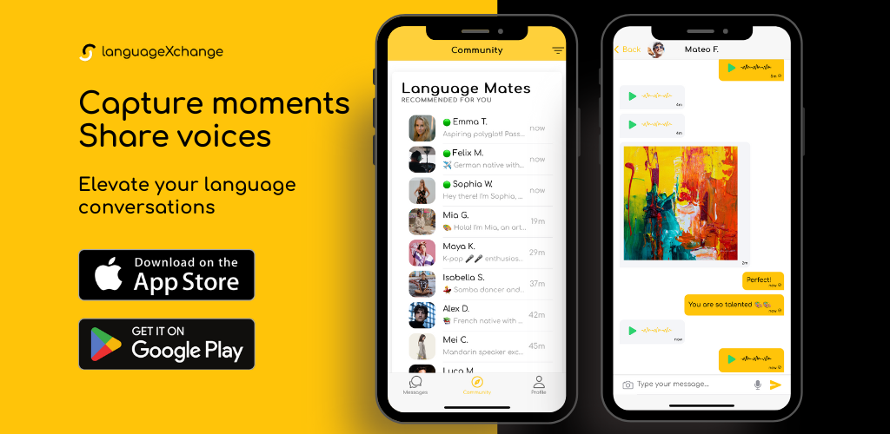

 <h1 align="center"> languageXchange | Practice, Learn, Succeed ! </h1>

  
  
  
  
  
  
  

  
  
  
  
  
  
  
  
  

  
  

 

# Announcement

1 - Don't miss out on securing your Early Adopter Badge! As a token of appreciation, these pioneering users will be gifted with exclusive benefits in the near future. Join us now and be part of the select group to enjoy special privileges down the road. Act fast, and let your journey with us begin with an exclusive touch!

2 - We're excited to announce that this project will be open sourced soon. Stay tuned for updates!

---

# Practice, Learn, Succeed!

## Words are the keys that unlock, a world of connections.

---

## Language learning can be a challenging but **rewarding process!**

---

## Features

- **Connect with language learners**: Find and connect with people who are eager to learn and teach languages.
- **Language Exchange Community**: Join a community of language learners and share your learning experiences.
- **Teach and Learn**: Teach your native language and learn a new one in return.

## How it Works

1. **Sign Up**: Create your account and list the languages you can teach and those you want to learn.
2. **Find Partners**: Browse through our community of language learners and find your perfect match.
3. **Start Exchanging**: Start your language exchange journey by teaching your native language and learning a new one.

## Contributing

We welcome contributions from the community. Please read our contributing guidelines for more information.
