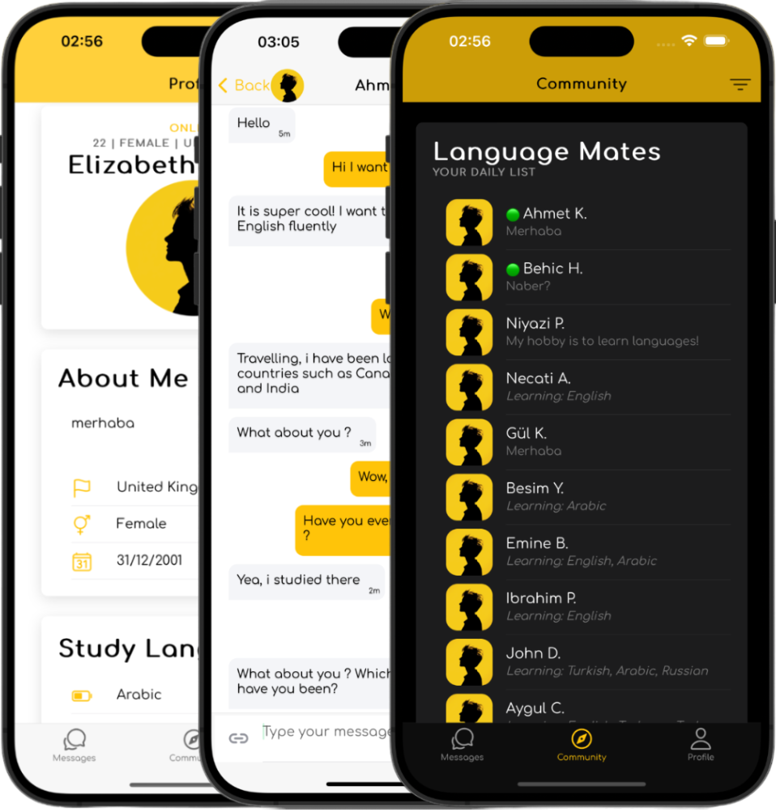

# Practice, Learn, Succeed!

### Words are the keys that unlock, a world of connections.

### Language learning can be a challenging but **rewarding process!**

## Features

- **Connect with language learners**: Find and connect with people who are eager to learn and teach languages.
- **Language Exchange Community**: Join a community of language learners and share your learning experiences.
- **Teach and Learn**: Teach your native language and learn a new one in return.

## How it Works

1. **Sign Up**: Create your account and list the languages you can teach and those you want to learn.
2. **Find Partners**: Browse through our community of language learners and find your perfect match.
3. **Start Exchanging**: Start your language exchange journey by teaching your native language and learning a new one.

## Contributing

We welcome contributions from the community. Please read our contributing guidelines for more information.
